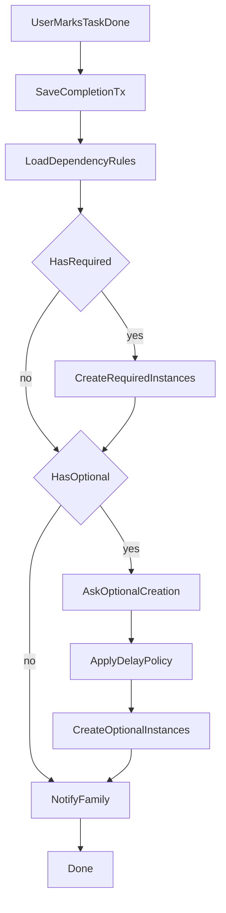

# Техническое задание: Telegram-бот учета домашних обязанностей

## 1. Цель и границы продукта

### 1.1 Цель
Разработать Telegram-бота для семейного учета домашних обязанностей с возможностью:
- вести состав семьи и роли участников;
- создавать и исполнять плановые задачи;
- автоматически порождать зависимые задачи;
- учитывать расписания и отсрочки;
- уведомлять участников о новых задачах;
- собирать статистику выполнения.

### 1.2 Технологии
- Язык разработки: `Python 3.12+`.
- Telegram framework: `aiogram 3.x`.
- База данных: `SQLite 3` (с включенными foreign keys).
- Архитектурный стиль: модульный монолит.

### 1.3 Область MVP
В MVP входят:
- роли и права доступа;
- управление составом семьи;
- управление плановыми задачами;
- постановка задач к выполнению вручную и по расписанию;
- отметка выполнения;
- обработка зависимостей задач;
- отмена последнего выполнения;
- уведомления и тихий режим;
- базовая статистика.

Не входят в MVP:
- веб-интерфейс;
- интеграции с внешними календарями;
- мультиязычность.

## 2. Термины и сущности

- **Семья**: изолированная группа пользователей с общим набором задач.
- **Участник семьи**: пользователь Telegram, добавленный в семью.
- **Плановая задача**: шаблон задачи (название, расписание, правила зависимостей).
- **Экземпляр задачи**: конкретная задача к выполнению с временем активации.
- **Выполнение**: факт отметки экземпляра как выполненного.
- **Зависимость**: правило создания дочерней задачи при выполнении родительской.
- **Отсрочка**: интервал до активации дочерней задачи.
- **Тихий режим**: расписание времени, когда уведомления отправляются беззвучно.

## 3. Роли и матрица прав

### 3.1 Роли
- Родитель
- Родитель-администратор
- Ребенок
- Ребенок-администратор

### 3.2 Инициализация ролей
- Первый пользователь, написавший боту (`/start`), автоматически становится **Родителем-администратором** и создает новую семью.
- Он может добавлять других участников по `@username`.
- Добавленный пользователь после первого `/start` получает сообщение:
  - что он добавлен в семью `<название семьи>`;
  - какая роль ему назначена;
  - предложение продолжить работу с ботом в этой роли.

### 3.3 Матрица прав

| Действие | Родитель | Родитель-админ | Ребенок | Ребенок-админ |
|---|---|---|---|---|
| Просмотр текущих задач | Да | Да | Да | Да |
| Добавить выполненную | Да | Да | Да | Да |
| Добавить к выполнению | Да | Да | Нет | Нет |
| Просмотр состава семьи | Да | Да | Да | Да |
| Правка состава семьи | Нет | Да | Нет | Да |
| Добавление родителя/ребенка | Нет | Да | Нет | Да |
| Просмотр плановых задач | Да | Да | Да | Да |
| Правка плановых задач | Нет | Да | Нет | Да |
| Настройка тихого режима других | Нет | Да | Нет | Да |

### 3.4 Ограничения по безопасности ролей
- Запрещено удалять последнего администратора семьи.
- Запрещено понижать последнего администратора до обычной роли.
- Все операции проверяются на принадлежность пользователя к семье.

## 4. UX и навигация

## 4.1 Главное меню (Reply)
- `Текущие задачи`
- `Добавить выполненную`
- `Добавить к выполнению` (только для родителей)
- `Прочее`

### 4.2 Меню "Прочее" (Reply)
- `Статистика`
- `Состав семьи`
- `Плановые задачи`
- `Назад`

### 4.3 Меню "Состав семьи" (Reply)
- `Список`
- `Править` (только для администраторов)
- `Добавить родителя` (только для администраторов)
- `Добавить ребенка` (только для администраторов)
- `Назад`

### 4.4 Меню "Состав семьи / Править" (Inline)
Сначала показывается сообщение `Состав семьи`, затем inline-кнопки участников.
В карточке участника:
- `Переименовать`
- `Удалить`
- `Сделать родителем` / `Сделать ребенком` (одна кнопка в зависимости от текущего типа)
- `Сделать админом` / `Сделать обычным` (одна кнопка)

### 4.5 Меню "Плановые задачи" (Reply)
- `Список`
- `Править` (только для администраторов)
- `Добавить` (только для администраторов)
- `Добавить (по-умолчанию)` (только для администраторов)
- `Назад`

### 4.6 Общий паттерн экранов
- Бот отправляет текст-инструкцию.
- Выбор сущностей — через inline-кнопки.
- Возврат на уровень выше — reply-кнопка `Назад`.
- Все многошаговые операции имеют `Отмена`.

## 5. Функциональные сценарии

### 5.1 Состав семьи
1. `Список` -> бот выводит `Состав семьи` и перечень участников с ролями.
2. `Добавить родителя/ребенка` -> администратор вводит `@username`, после валидации участник сохраняется.
3. `Править` -> администратор выбирает участника и применяет действие.

### 5.2 Текущие задачи
1. Пользователь выбирает `Текущие задачи`.
2. Бот отправляет `Выберите выполненное действие`.
3. Показываются inline-кнопки активных задач.
4. После выбора задача отмечается выполненной и запускается обработка зависимостей.

### 5.3 Добавить выполненную
1. Пользователь выбирает `Добавить выполненную`.
2. Бот отправляет `Выберите выполненную задачу`.
3. Показываются inline-кнопки плановых задач.
4. По выбору создается запись выполнения (без требования, чтобы задача была активной).
5. Обязательные зависимые задачи создаются автоматически.

### 5.4 Добавить к выполнению (только родители)
1. Родитель выбирает `Добавить к выполнению`.
2. Бот отправляет `Выберите задачу к выполнению`.
3. Родитель выбирает шаблон задачи.
4. Бот предлагает:
   - `Добавить сейчас`;
   - `Добавить с отсрочкой`.
5. При отсрочке вводится время `чч:мм` (локальное время семьи).

### 5.5 Отмена последнего выполнения
- Доступна команда `Отменить последнее выполнение`.
- Отменяет только последнее действие текущего пользователя по отметке выполнения.
- Откатывает связанные автосозданные дочерние задачи, если они не были изменены другими действиями.

## 6. Правила движка задач

### 6.1 Модель зависимостей
- Зависимости задаются между плановыми задачами как DAG (ориентированный ациклический граф).
- Для каждой связи хранятся:
  - `is_required` (обязательная/опциональная);
  - `delay_mode` (`none`, `fixed`, `configurable`);
  - `default_delay_minutes` (для `fixed` и `configurable`).

### 6.2 Поведение при выполнении
- Для обязательных связей: дочерние задачи создаются автоматически.
- Для опциональных: пользователю показывается предложение добавить задачу.
- Для `configurable`:
  - `Отсрочка (<значение по-умолчанию>)`
  - `Отсрочка (настраиваемая)`
  - `Без отсрочки`

### 6.3 Дедупликация
Для MVP принять правило:
- если у семьи уже есть активный экземпляр этой же плановой задачи со статусом `pending`/`scheduled`, новый экземпляр **не создается**;
- в лог добавляется событие подавления дубля.

### 6.4 Примеры поддерживаемых цепочек
- `Кормление собак` -> `Гуляние с собаками` (без отсрочки) -> `Мойка собак` (+15 мин).
- `Кормление Альмы и Эбби` -> `Гуляние с Альмой`, `Гуляние с Эбби` -> `Мойка Эбби` (+15, обязательная), `Мойка Альмы` (+15, опциональная).
- `Загрузка посудомойки` -> `Разгрузка посудомойки` (настраиваемая отсрочка, default 4 часа).

## 7. Расписание и генерация задач

### 7.1 Поддерживаемые режимы расписания
- несколько срабатываний в день;
- отдельные наборы времен для будней и выходных;
- индивидуальные расписания для каждого дня недели.

### 7.2 Планировщик
- Фоновый scheduler проверяет наступившие события не реже 1 раза в минуту.
- При наступлении времени создаются экземпляры задач.
- Все времена рассчитываются в таймзоне семьи.

### 7.3 Отложенная ручная постановка
- Для ручной постановки с временем `чч:мм` создается экземпляр в статусе `scheduled`.
- В момент активации статус меняется на `pending`, затем отправляются уведомления.

## 8. Уведомления и тихий режим

### 8.1 Базовая логика уведомлений
- При появлении новой активной задачи бот отправляет уведомления всем участникам семьи.
- Текст уведомления содержит:
  - название задачи;
  - кто инициировал (если применимо);
  - время активации.

### 8.2 Тихий режим
- Настраивается администратором для каждого пользователя:
  - либо единое правило на всю неделю;
  - либо по каждому дню недели отдельно.
- В тихий интервал сообщения отправляются с `disable_notification=true`.

### 8.3 Ошибки уведомлений
- Ошибки отправки логируются, не прерывают транзакцию бизнес-операции.
- При блокировке бота пользователем устанавливается флаг `is_reachable=false`.

## 9. SQLite: схема данных

Ниже — минимальная логическая схема.

### 9.1 Таблицы
- `families`
  - `id`, `name`, `timezone`, `created_at`, `created_by_user_id`
- `users`
  - `id`, `tg_user_id`, `username`, `display_name`, `is_reachable`, `created_at`
- `family_members`
  - `id`, `family_id`, `user_id`, `role_type` (`parent`/`child`), `is_admin`, `joined_at`, `is_active`
- `planned_tasks`
  - `id`, `family_id`, `title`, `description`, `is_active`, `created_by`, `created_at`, `updated_at`
- `default_tasks`
  - `id`, `title`, `description`, `default_schedule_json`, `default_dependencies_json`, `sort_order`, `is_active`
- `task_dependency_rules`
  - `id`, `family_id`, `parent_task_id`, `child_task_id`, `is_required`, `delay_mode`, `default_delay_minutes`
- `task_schedules`
  - `id`, `task_id`, `day_of_week`, `time_hhmm`, `is_weekend_profile`, `is_active`
- `task_instances`
  - `id`, `family_id`, `planned_task_id`, `status` (`scheduled`/`pending`/`done`/`cancelled`), `due_at`, `activated_at`, `created_by`, `source_type` (`manual`/`schedule`/`dependency`), `source_ref_id`
- `task_completions`
  - `id`, `task_instance_id`, `family_id`, `planned_task_id`, `completed_by`, `completed_at`, `completion_mode` (`current`/`manual`)
- `undo_log`
  - `id`, `family_id`, `user_id`, `action_type`, `action_ref_id`, `payload_json`, `created_at`, `is_reverted`
- `notification_quiet_hours`
  - `id`, `family_id`, `user_id`, `day_of_week`, `quiet_from`, `quiet_to`, `is_all_week`

### 9.2 Ограничения
- `users.tg_user_id` — `UNIQUE`.
- `family_members(family_id, user_id)` — `UNIQUE`.
- `task_dependency_rules(parent_task_id, child_task_id)` — `UNIQUE`.
- FK во всех дочерних таблицах.
- `CHECK`-ограничения для enum-полей (`status`, `delay_mode`, `role_type`).

### 9.3 Индексы
- `task_instances(family_id, status, activated_at)`.
- `task_instances(family_id, due_at)`.
- `task_completions(family_id, completed_at)`.
- `planned_tasks(family_id, is_active)`.
- `family_members(family_id, is_active, is_admin)`.

## 10. FSM (состояния диалогов)

### 10.1 Family FSM
- `family_add_member_wait_username`
- `family_edit_member_select`
- `family_edit_member_action`

### 10.2 Tasks FSM
- `task_add_title`
- `task_add_schedule_mode`
- `task_add_schedule_days`
- `task_add_dependencies`
- `task_add_dependency_delay_mode`
- `task_add_dependency_delay_value`

### 10.3 Runtime FSM
- `add_to_execution_select_task`
- `add_to_execution_delay_choice`
- `add_to_execution_wait_time`
- `complete_optional_dependency_confirm`
- `complete_configurable_delay_choice`
- `complete_configurable_delay_value`

### 10.4 Notification FSM
- `quiet_mode_select_user`
- `quiet_mode_select_scope`
- `quiet_mode_set_interval`

### 10.5 Общие требования FSM
- В каждом состоянии поддерживаются команды `Назад` и `Отмена`.
- На невалидный ввод бот возвращает конкретную причину и формат правильного ввода.

## 11. Валидации

- Telegram username:
  - начинается с `@`;
  - длина 5..32 символа;
  - допустимы латинские буквы, цифры и `_`.
- Время `чч:мм` — 24-часовой формат.
- Отсрочка:
  - минимальная: 0 минут;
  - максимальная: 7 суток.
- Запрещены циклы зависимостей.
- Запрещено межсемейное редактирование сущностей.

## 12. Статистика (MVP)

### 12.1 Метрики
- Количество выполненных задач по пользователям.
- Количество выполненных задач по типам (плановым задачам).
- Количество активных и просроченных задач.

### 12.2 Периоды
- Сегодня
- Неделя
- Месяц

### 12.3 Доступ
- Все участники: агрегированные семейные показатели.
- Администраторы: детализация по каждому участнику.

## 13. Нефункциональные требования

- Операции выполнения/undo выполняются в транзакции.
- Целевое время ответа на пользовательские действия: до 2 секунд.
- Все ключевые действия пишутся в аудит-лог.
- Код должен быть покрыт unit/integration тестами критических сценариев.

## 14. Критерии приемки

1. Первый пользователь становится родителем-администратором и может создать семью.
2. Администратор добавляет участников по `@username`, участник подтверждается после `/start`.
3. В `Состав семьи` доступны просмотр и редактирование с ограничениями прав.
4. В `Плановые задачи` можно добавлять, редактировать и просматривать задачи.
5. Расписание корректно создает задачи в нужное время и таймзоне.
6. Выполнение задачи порождает зависимые задачи по правилам обязательности и отсрочки.
7. Опциональные зависимости требуют подтверждения пользователя.
8. Работает команда отмены последнего выполнения с откатом автосозданных эффектов.
9. Уведомления отправляются всем участникам, тихий режим применяет беззвучную отправку.
10. Статистика за периоды доступна согласно правам.

## 15. Порядок реализации

### Этап 1. Базовая платформа
- Инициализация бота, конфигурация, миграции SQLite.
- Онбординг, семьи, роли, права.

### Этап 2. Плановые задачи и расписания
- CRUD плановых задач.
- Конструктор расписаний.
- Фоновый scheduler.

### Этап 3. Выполнения и зависимости
- Механика `Текущие задачи` / `Добавить выполненную` / `Добавить к выполнению`.
- Движок зависимостей и отсрочек.
- Undo последнего выполнения.

### Этап 4. Уведомления и тихий режим
- Канал уведомлений.
- Настройки quiet mode по пользователям.

### Этап 5. Статистика и стабилизация
- Экран статистики.
- Тесты, логирование, hardening.

## 16. Диаграмма потока выполнения

